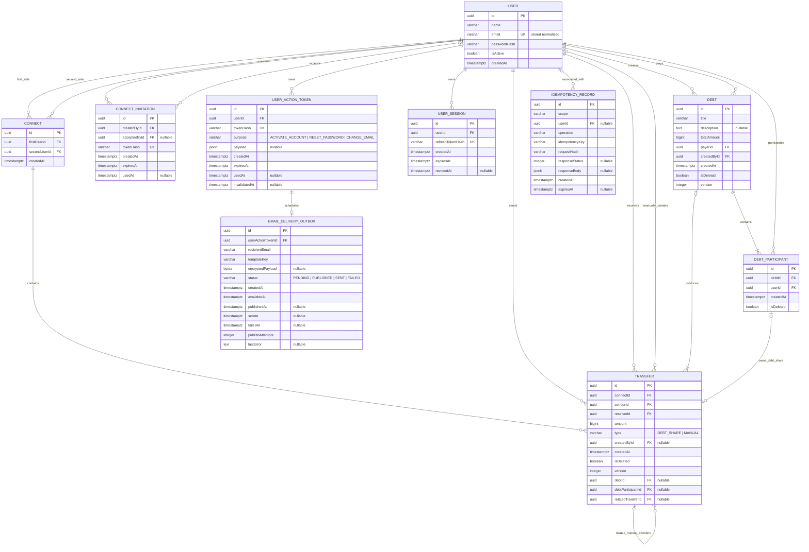

# Equo — ER-диаграмма MVP v1

## Метаданные артефакта

| Поле | Значение |
|---|---|
| Название | Equo — ER-диаграмма MVP v1 |
| Назначение | Описать десять персистентных сущностей, их поля, ключи, ограничения и связи |
| Статус | Финальная согласованная версия этапа проектирования |
| Версия | 1 |
| Дата актуальности | 2026-07-27 |
| Владелец | Maksim Smolkov |
| Источник | `equo-04-er-diagram.md`, `.dot`, `.svg` и `.png` из приложенного архива `equo-artifacts-final.zip`; решения владельца от 2026-07-27 |

Представления диаграммы: [редактируемый DOT](er-diagram.dot), [SVG](er-diagram.svg), [PNG](er-diagram.png).

## 1. Статус и область

**Статус:** финальная согласованная версия этапа проектирования.

Диаграмма описывает десять персистентных сущностей, включая инфраструктурный email outbox. Производные read-модели, брокерные очереди RabbitMQ, логи и метрики в ER-диаграмму не входят.

Связанные документы: [глоссарий](../glossary/glossary.md), [бизнес-правила](../business-rules/business-rules.md), [модель сущностей](entities.md), [HTTP-контракты](../api/http-contracts.md), [ADR](../adr/architecture-decisions.md).

## 2. Сущности

### Бизнес-сущности

- `User`
- `Connect`
- `ConnectInvitation`
- `Debt`
- `DebtParticipant`
- `Transfer`

### Инфраструктурные сущности

- `UserSession`
- `UserActionToken`
- `IdempotencyRecord`
- `EmailDeliveryOutbox`

---

## 3. ER-диаграмма Mermaid



---

## 4. Первичные ключи

У каждой сущности один первичный ключ:

```text
id UUID PRIMARY KEY
```

Это относится ко всем десяти сущностям.

---

## 5. Внешние ключи

| Таблица | Поле | Ссылка | Nullable |
|---|---|---|---:|
| `Connect` | `firstUserId` | `User.id` | нет |
| `Connect` | `secondUserId` | `User.id` | нет |
| `ConnectInvitation` | `createdById` | `User.id` | нет |
| `ConnectInvitation` | `acceptedById` | `User.id` | да |
| `Debt` | `payerId` | `User.id` | нет |
| `Debt` | `createdById` | `User.id` | нет |
| `DebtParticipant` | `debtId` | `Debt.id` | нет |
| `DebtParticipant` | `userId` | `User.id` | нет |
| `Transfer` | `connectId` | `Connect.id` | нет |
| `Transfer` | `senderId` | `User.id` | нет |
| `Transfer` | `receiverId` | `User.id` | нет |
| `Transfer` | `createdById` | `User.id` | да |
| `Transfer` | `debtId` | `Debt.id` | да |
| `Transfer` | `debtParticipantId` | `DebtParticipant.id` | да |
| `Transfer` | `relatedTransferId` | `Transfer.id` | да |
| `UserSession` | `userId` | `User.id` | нет |
| `UserActionToken` | `userId` | `User.id` | нет |
| `IdempotencyRecord` | `userId` | `User.id` | да |
| `EmailDeliveryOutbox` | `userActionTokenId` | `UserActionToken.id` | нет |

Для бизнес- и финансовых данных используются `ON DELETE NO ACTION` / `RESTRICT`. Каскадное физическое удаление финансовой истории не применяется.

---

## 6. Уникальные ограничения

### `User`

```text
UNIQUE(email)
```

Перед сохранением email нормализуется: удаляются пробелы по краям и значение приводится к нижнему регистру.

### `Connect`

```text
UNIQUE(firstUserId, secondUserId)
CHECK(firstUserId < secondUserId)
```

Канонический порядок одновременно обеспечивает неориентированность пары и защищает от зеркальных дублей.

### `ConnectInvitation`

```text
UNIQUE(tokenHash)
CHECK((usedAt IS NULL) = (acceptedById IS NULL))
CHECK(expiresAt > createdAt)
```

Правило «не более одного действующего неиспользованного приглашения» проверяется доменным слоем. Get-or-create сериализуется блокировкой автора или advisory lock, потому что при отсутствии приглашения его строку заблокировать невозможно.

### `DebtParticipant`

```text
UNIQUE(debtId, userId)
```

Ограничение включает мягко удалённые записи и позволяет восстанавливать прежнюю запись без создания дубля.

### `Transfer`

```text
UNIQUE(debtParticipantId)
WHERE type = 'DEBT_SHARE'
```

Один `DebtParticipant` может иметь не более одного автоматического трансфера.

### `UserSession`

```text
UNIQUE(refreshTokenHash)
```

### `UserActionToken`

```text
UNIQUE(tokenHash)

UNIQUE(userId, purpose)
WHERE usedAt IS NULL
  AND invalidatedAt IS NULL
```

Частичный индекс гарантирует не более одного незавершённого токена на `(userId, purpose)`. При выдаче доменный слой блокирует строку `User`, аннулирует прежний незавершённый токен и только затем создаёт новый в той же транзакции.

### `IdempotencyRecord`

```text
UNIQUE(scope, operation, idempotencyKey)
```

`scope` задаёт пространство идемпотентности:

- для авторизованной команды: `user:<userId>`;
- для регистрации: `public`.

`userId` хранится дополнительно как nullable FK для навигации и аудита, но не является источником уникальности.

### `EmailDeliveryOutbox`

```text
UNIQUE(userActionTokenId)
```

Для одного токена существует не более одного задания доставки.

---

## 7. Локальные CHECK-ограничения

### `Connect`

```text
firstUserId <> secondUserId
firstUserId < secondUserId
```

### `ConnectInvitation`

```text
(usedAt IS NULL AND acceptedById IS NULL)
OR
(usedAt IS NOT NULL AND acceptedById IS NOT NULL)
```

### `Debt`

```text
totalAmount > 0
version >= 1
title <> ''
```

### `Transfer`

```text
amount > 0
senderId <> receiverId
version >= 1
type IN ('DEBT_SHARE', 'MANUAL')
```

Согласованность nullable-полей по типу:

```text
type = 'DEBT_SHARE'
AND createdById IS NULL
AND debtId IS NOT NULL
AND debtParticipantId IS NOT NULL
AND relatedTransferId IS NULL
```

либо:

```text
type = 'MANUAL'
AND createdById IS NOT NULL
AND debtId IS NULL
AND debtParticipantId IS NULL
```

Для `MANUAL` поле `relatedTransferId` может быть `NULL` или ссылаться на `DEBT_SHARE`.

### `UserActionToken`

Статические ограничения:

```text
expiresAt > createdAt
NOT (usedAt IS NOT NULL AND invalidatedAt IS NOT NULL)
```

Активный токен:

```text
usedAt IS NULL
AND invalidatedAt IS NULL
AND expiresAt > now()
```

Условие `expiresAt > now()` используется в запросах и доменном слое, а не в статическом `CHECK`, поскольку `now()` меняется со временем.

Для `CHANGE_EMAIL` `payload` содержит `newEmail`; для других назначений `payload = NULL`. Структура JSON проверяется приложением.

### `EmailDeliveryOutbox`

```text
publishAttempts >= 0
availableAt >= createdAt
NOT (sentAt IS NOT NULL AND failedAt IS NOT NULL)
status IN ('PENDING', 'PUBLISHED', 'SENT', 'FAILED')
```

Согласованность статуса, временных меток и наличия `encryptedPayload` дополнительно проверяется приложением.

---

## 8. Межтабличные инварианты доменного слоя

Эти правила не дублируются триггерами PostgreSQL:

- стороны `Transfer` совпадают со сторонами `Connect`;
- для `DEBT_SHARE` отправитель равен плательщику долга;
- получатель `DEBT_SHARE` равен пользователю `DebtParticipant`;
- `DebtParticipant.debtId` совпадает с `Transfer.debtId`;
- `relatedTransferId` указывает на `DEBT_SHARE` того же `Connect`;
- автор долга является плательщиком или текущим участником (`DebtParticipant.isDeleted = false`);
- у неудалённого долга есть хотя бы один текущий участник (`DebtParticipant.isDeleted = false`), отличный от плательщика;
- каждый долг имеет как минимум один связанный `DEBT_SHARE`;
- для каждого текущего участника, кроме плательщика, существует `DEBT_SHARE`;
- для плательщика self-transfer отсутствует;
- плательщик долга неизменяем;
- удалённый долг и его состав больше не изменяются.
- `EmailDeliveryOutbox.recipientEmail` и `templateKey` соответствуют purpose связанного токена;
- consumer отправляет письмо только для текущего, неиспользованного, неаннулированного и неистёкшего токена;
- relay переводит outbox в `PUBLISHED` только после publisher confirm RabbitMQ.

Все изменения агрегата долга выполняются одной транзакцией.

---

## 9. Проверка кардинальностей

| Связь | Кардинальность |
|---|---|
| `User` → `Connect.firstUserId` | один пользователь — 0..N коннектов; у коннекта ровно одна первая сторона |
| `User` → `Connect.secondUserId` | один пользователь — 0..N коннектов; у коннекта ровно одна вторая сторона |
| `User` → `ConnectInvitation.createdById` | один пользователь — 0..N приглашений; у приглашения ровно один автор |
| `User` → `ConnectInvitation.acceptedById` | один пользователь — 0..N принятых приглашений; приглашение принято 0..1 пользователем |
| `User` → `Debt.createdById` | один пользователь — 0..N долгов; у долга ровно один автор |
| `User` → `Debt.payerId` | один пользователь — 0..N долгов; у долга ровно один плательщик |
| `Debt` → `DebtParticipant` | у долга 1..N записей участия; участие относится ровно к одному долгу |
| `User` → `DebtParticipant` | пользователь — 0..N участий; участие относится ровно к одному пользователю |
| `Connect` → `Transfer` | коннект — 0..N трансферов; трансфер относится ровно к одному коннекту |
| `User` → `Transfer.senderId` | пользователь — 0..N исходящих; у трансфера ровно один отправитель |
| `User` → `Transfer.receiverId` | пользователь — 0..N входящих; у трансфера ровно один получатель |
| `User` → `Transfer.createdById` | пользователь — 0..N ручных трансферов; у трансфера 0..1 автора |
| `Debt` → `Transfer.debtId` | долг — 1..N автоматических трансферов; у трансфера 0..1 долга |
| `DebtParticipant` → `Transfer.debtParticipantId` | участие — 0..1 автоматический трансфер; у трансфера 0..1 участия |
| `Transfer` → `Transfer.relatedTransferId` | `DEBT_SHARE` — 0..N связанных `MANUAL`; у `MANUAL` 0..1 связанная доля |
| `User` → `UserSession` | пользователь — 0..N сессий; у сессии ровно один пользователь |
| `User` → `UserActionToken` | пользователь — 0..N токенов; у токена ровно один пользователь |
| `User` → `IdempotencyRecord` | пользователь — 0..N записей; у записи 0..1 пользователь |
| `UserActionToken` → `EmailDeliveryOutbox` | токен — 0..1 задание доставки; у задания ровно один токен |

---

## 10. Итог

Сущности, поля, nullable-состояния, PK, FK, уникальные ограничения и кардинальности совпадают с [моделью сущностей](entities.md). Динамические межтабличные инварианты намеренно остаются в доменном слое и перечислены в [бизнес-правилах](../business-rules/business-rules.md).
